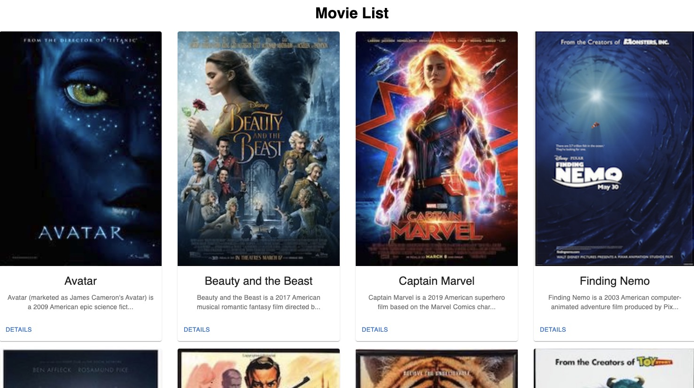
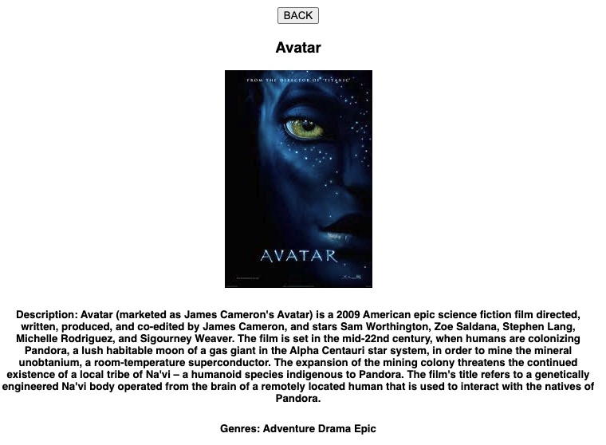

# Movie-Sagas

## Description

_Duration: Weekend Sprint_

This application is a single page application (SPA) that shows a list of all movies on the homepage populated from the database. To see additional details for a movie the user can click the details button and they will be routed to show the entire description and associated genres.

## Screenshots
HOME PAGE:

DETAILS PAGE:

### Prerequisites

- [Node.js](https://nodejs.org/en/)

## Installation

1. Create a database named `saga_movies_weekend`
2. The queries in the `database.sql` file are set up to create all the necessary tables and populate the needed data to allow the application to run correctly. The project is built on [Postgres](https://www.postgresql.org/download/), so you will need to make sure to have that installed. Recommend using Postico to run the queries as that was used to create the queries. 
3. Open up your editor of choice and run `npm install`
4. Run `npm run server` in a terminal
5. Run `npm run client` in another terminal
6. The `npm run client` command will open up a new browser tab for you

## Technologies
React, Redux Saga, Node, Material-UI, Javascript, HTML/CSS, PostgreSQL